# Лабораторная работа №20: Оптимизация работы Windows

**Цель:** Изучить принцип оптимизации ОС Windows для работы с аппаратным обеспечением.

---

## 1. Теоретические сведения: Процессор

**Центральный процессор (CPU)** — главный компонент компьютера, отвечающий за вычисления и обработку команд. Состоит из миллионов транзисторов, образующих логические схемы на кремниевом кристалле («камне»). В основе CPU лежит арифметико-логическое устройство (АЛУ), регистры, кэш-память и схемы управления шинами.

**Основные характеристики процессора:**

| Характеристика | Описание |
|---|---|
| **Тактовая частота** | Количество операций в секунду (ГГц). Чем выше, тем быстрее вычисления. |
| **Разрядность** | Поддерживаемая архитектура: 32-бит (до 4 ГБ ОЗУ) или 64-бит (свыше 4 ГБ ОЗУ). |
| **Кэш-память (L1, L2, L3)** | Сверхбыстрая память внутри процессора. Уменьшает задержки при доступе к ОЗУ. Больше кэша — быстрее сложные задачи (архивация, рендеринг). |
| **Количество ядер** | Отдельные вычислительные блоки в одном корпусе. 2 ядра ≈ два процессора под одной крышкой. Чем больше ядер, тем эффективнее многозадачность. |

---

## 2. Задание на лабораторную работу

### Часть 1. Оптимизация работы процессора

**Шаг 1. Загрузка в виртуальную машину**
- Запустите виртуальную машину с Windows 10.

**Шаг 2–4. Конфигурация системы (msconfig)**
- Нажмите `Win + R`, введите `msconfig` → Enter.
- Вкладка **Загрузка** → **Дополнительные параметры**.
- Установите:
  - ✅ **Число процессоров**: максимально доступное значение.
  - ✅ **Максимум памяти**: максимально доступное значение.
- Нажмите **ОК** → **Применить**.
- Перезагрузите виртуальную машину.
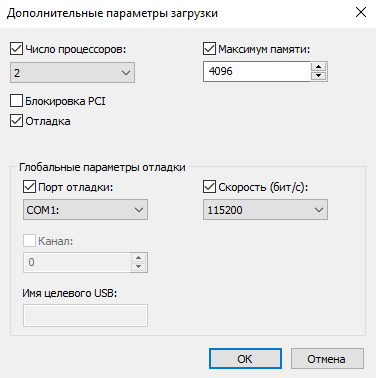

**Шаг 5. Настройка электропитания**
- Запустите командную строку (`cmd`) и выполните:
  ```cmd
  rundll32 shell32.dll,Control_RunDLL PowerCfg.cpl
  ```

**Шаг 6. Выбор схемы**
- Выберите план **«Высокая производительность»** → **Настройка плана электропитания**.

**Шаг 7. Настройка отключения дисплея и сна**
- Переведите все параметры в положение **«Никогда»**.
- Нажмите **Сохранить изменения**.

**Шаг 8–10. Дополнительные параметры питания**
- Вернитесь в **Настройка плана** → **Изменить дополнительные параметры питания**.
- Настройте по скриншотам из методички (основные блоки):

  **Жёсткий диск:**
  - Отключать жёсткий диск через: `Никогда`

  **Internet Explorer / Фоновый рисунок рабочего стола (Слайд-шоу):**
  - Приостановить: `Приостановлено` (если есть)

  **Параметры адаптера беспроводной сети:**
  - Режим энергосбережения: `Максимальная производительность`

  **Сон:**
  - Сон после: `Никогда`
  - Гибернация после: `Никогда`
  - Разрешить таймеры пробуждения: `Отключить`

  **Параметры USB:**
  - Параметр временного отключения USB-порта: `Запрещено`

  **Управление питанием процессора:**
  - Минимальное состояние: `100%`
  - Максимальное состояние: `100%`

  **Экран:**
  - Отключать экран через: `Никогда`

  **PCI Express:**
  - Управление питанием состояния связи: `Выкл.`

- Нажмите **Применить** → **ОК**.
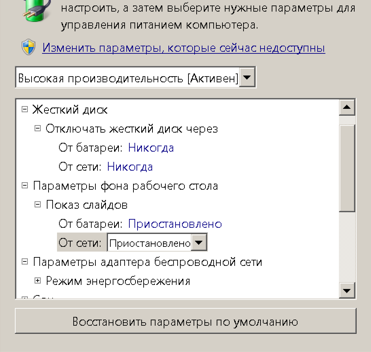

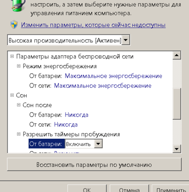

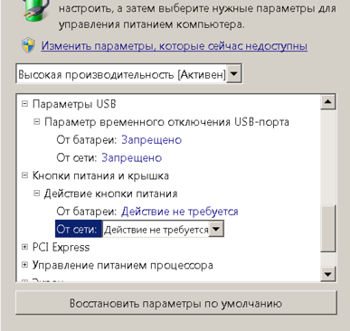

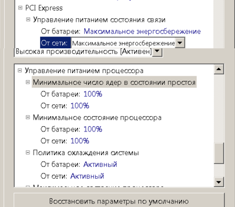

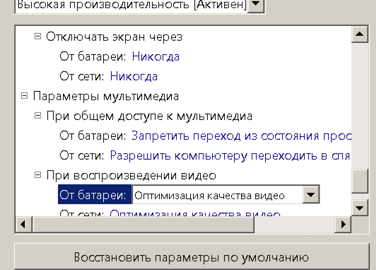

**Шаг 11. Кэш второго уровня (L2)**
- Запустите командную строку **от имени Администратора**.
- Проверьте текущий кэш:
  ```cmd
  wmic cpu get L2CacheSize, L2CacheSpeed
  ```
  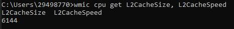

- Добавьте параметр в реестр (значение в килобайтах, например 1024 для 1 МБ, 2048 для 2 МБ и т.д.):
  ```cmd
  reg add "HKLM\SYSTEM\CurrentControlSet\Control\Session Manager\Memory Management" /v SecondLevelDataCache /t REG_DWORD /d 1024 /f
  ```
  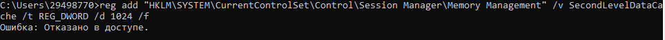

---

### Часть 2. Оптимизация работы жёсткого диска

**Шаг 12–15. Настройка квот**
- Откройте **Проводник** → **Этот компьютер**.
- Правой кнопкой по диску **C:** → **Свойства**.
- Вкладка **Квота** → **Показать параметры квоты**.
- ✅ **Включить управление квотами**
- ✅ **Не выделять место на диске при превышении квоты**
- Установите предел (например, 1 ГБ) и порог предупреждения.
- Нажмите **Применить** → **ОК**.
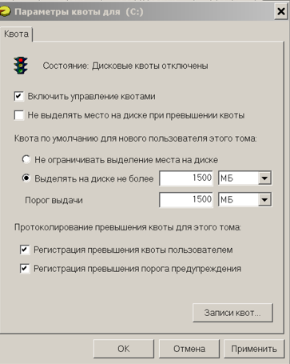

**Шаг 16–18. Дефрагментация диска**
- В меню **Пуск** введите `Дефрагментация` → откройте **Дефрагментация и оптимизация дисков**.
- Выберите диск **C:**.
- Нажмите **Изменить параметры** → настройте расписание (еженедельно).
- Нажмите **Оптимизировать**.
- Дождитесь завершения, затем **Закрыть**.
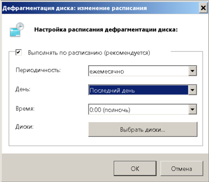

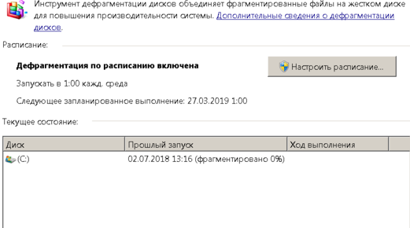

**Шаг 19–22. Политика кэширования**
- Нажмите `Win + X` → **Диспетчер устройств**.
- Разверните **Дисковые устройства**.
- Правой кнопкой по виртуальному диску → **Свойства**.
- Вкладка **Политика**.
- Отметьте **«Быстрое удаление»** (журналирование отключено, можно извлекать без безопасного отключения).
- Нажмите **ОК**.
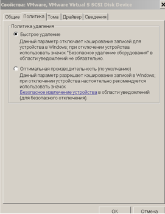

**Шаг 23. Точка восстановления системы**
- Правый клик по **Этот компьютер** → **Свойства**.
- Слева: **Защита системы**.
- На вкладке **Защита системы**:
  - Выберите диск **C:** → **Создать**.
  - Введите описание: `Application Installed`.
  - Нажмите **Создать** → дождитесь сообщения об успехе → **Закрыть**.
- Через меню **Пуск** найдите **Восстановление системы** (или `rstrui.exe`).
- Нажмите **Далее** → увидите созданную точку → **Отмена**.
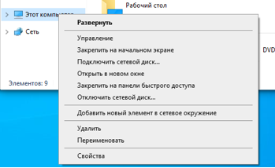

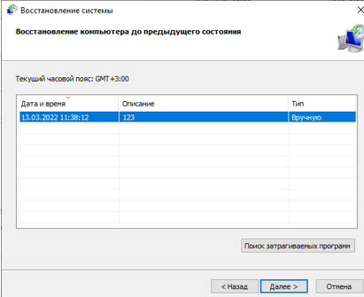

**Шаг 24. Компоненты Windows (IIS)**
- Нажмите `Win + R` → `appwiz.cpl` → Enter.
- Слева: **Включение или отключение компонентов Windows**.
- Найдите и отметьте галочкой **Службы IIS**.
- Дождитесь установки, нажмите **ОК**.
- **Перезагрузите** виртуальную машину.
- После перезагрузки откройте браузер **Edge**.
- В адресной строке введите:
  ```
  localhost
  ```
- Должна открыться стартовая страница IIS.
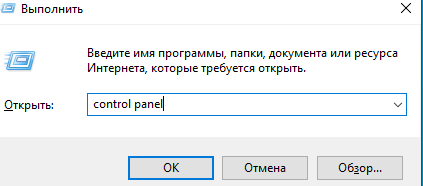

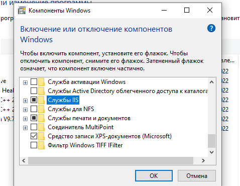

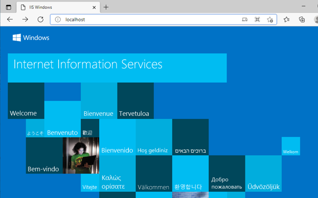

---

## 3. Контрольные вопросы (письменно в тетрадь)

**Вопрос 1. Что такое процессор и его основные характеристики.**

> **Процессор (CPU)** — центральное вычислительное устройство компьютера, выполняющее машинные инструкции программ. Расположен на кремниевом кристалле, содержит миллионы транзисторов. Включает АЛУ, регистры, кэш и схемы управления.
>
> **Основные характеристики:**
> 1. **Тактовая частота** — скорость выполнения операций (ГГц).
> 2. **Разрядность** — 32 или 64 бит; влияет на максимальный объём ОЗУ.
> 3. **Кэш-память (L1/L2/L3)** — встроенная сверхбыстрая память.
> 4. **Количество ядер** — число параллельно работающих вычислительных блоков.

**Вопрос 2. Какого типа созданная вами точка восстановления?**

> Создана **ручная (пользовательская) точка восстановления**. Она инициирована вручную пользователем через окно «Защита системы» с описанием `Application Installed`. Такие точки создаются перед значительными изменениями (например, установка ПО) и хранят снимок системных файлов, реестра и драйверов на момент создания.

**Вопрос 3. Чем отличаются параметры политики удаления в настройках жёсткого диска?**

> Доступны две политики:
> 1. **Быстрое удаление** — отключает кэширование записи на диск. Это безопасно при отключении USB-накопителей без использования «Безопасного извлечения», но снижает производительность записи.
> 2. **Оптимальная производительность** — включает кэширование записи. Повышает скорость работы, но требует обязательного использования «Безопасного извлечения устройства» для предотвращения потери данных.

---