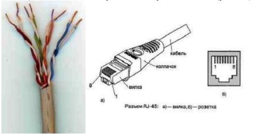
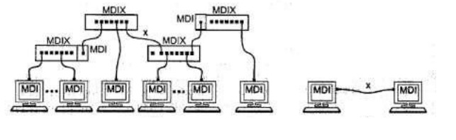
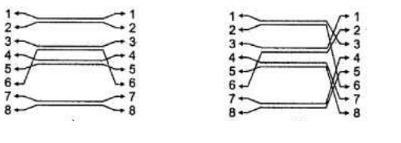
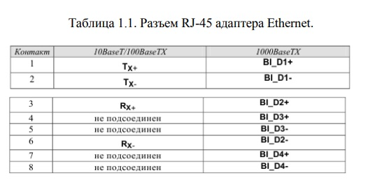
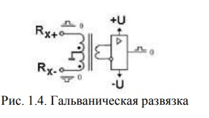
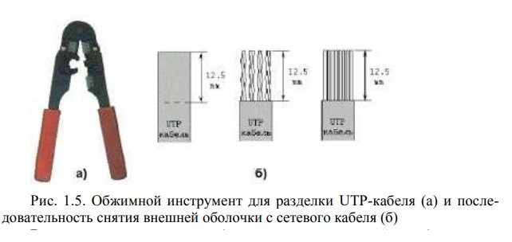
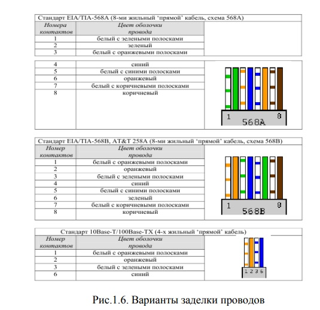
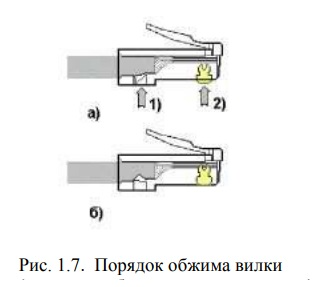
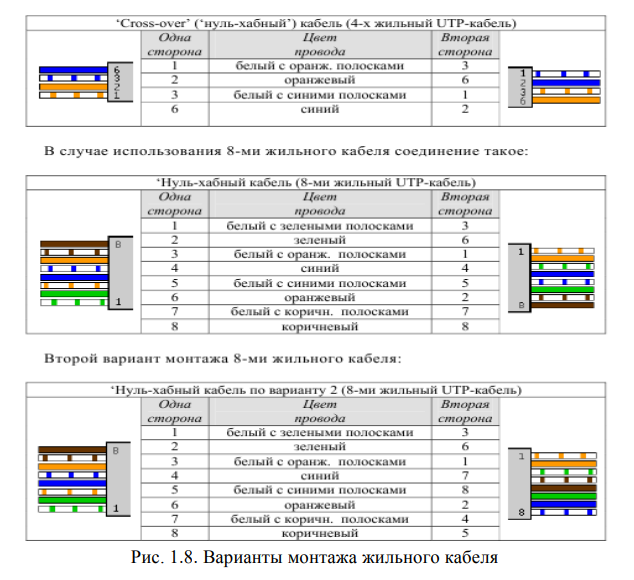
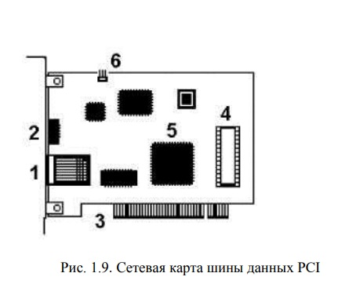

# КОНСПЕКТ: Сети и телекоммуникации

## Введение

**Цель дисциплины:** получение теоретических и практических основ архитектурной и системотехнической организации вычислительных сетей.

**Ожидаемые результаты:**

| Знать | Уметь | Владеть |
|-------|-------|---------|
| Сетевые технологии и основы построения протоколов | Проектировать и эксплуатировать компьютерные сети | Навыками разработки и администрирования сетей |
| Основные стандарты в области инфокоммуникаций | Документировать предлагаемые решения | |

---

## Подключение ПК к локальной вычислительной сети

### Определения (термины)

| Термин | Определение |
|--------|-------------|
| **Ethernet** | Сетевой стандарт, разработанный в 1975 г. в Xerox, доработанный DEC, Intel и Xerox (DIX). |
| **IEEE 802.3** | Стандарт, одобренный в 1985 г. комитетом IEEE на основе Ethernet DIX. |
| **CSMA/CD** | Carrier Sense Multiple Access with Collision Detection — метод коллективного доступа с опознаванием несущей и обнаружением коллизий. |
| **UTP (Unshielded Twisted Pair)** | Неэкранированная витая пара — наиболее дешёвый тип кабеля для Ethernet. |
| **Категории UTP** | CAT5 (100 МГц, 100 Мбит/с), CAT5e (125 МГц, 1 Гбит/с), CAT6 (250 МГц, 1-10 Гбит/с), CAT7 (600-700 МГц, до 100 Гбит/с). |
| **RJ-45** | Разъём для UTP-кабеля (правильное название коннектора — 8P8C). |
| **Patch cord** | Отрезок UTP-кабеля (обычно до 5 м) с обжатыми вилками RJ-45 на концах. |
| **MDI (Medium Depended Interface)** | Разъём сетевого адаптера. |
| **MDIX (MDI crossing)** | Разъём портов сетевого концентратора/коммутатора. |
| **Прямой кабель** | Используется для соединения MDI–MDIX (ПК → коммутатор). |
| **Перекрёстный (кроссовый) кабель** | Используется для соединения MDI–MDI (ПК–ПК) или MDIX–MDIX. |
| **Auto-MDI/MDIX** | Функция автоопределения типа кабеля в современных коммутаторах. |
| **Гальваническая развязка** | Отсутствие прямого электрического контакта между входными и выходными цепями сетевых адаптеров. |
| **MAC-адрес** | Уникальный 48-битный (6 байт) серийный номер сетевого устройства. Первые 3 байта — идентификатор производителя. |
| **Auto negotiation** | Протокол согласования режимов, позволяющий выбрать максимальную общую скорость при соединении. |
| **Plug-and-Play** | Технология автоматического конфигурирования сетевых карт (адрес ввода-вывода и IRQ). |
| **Нуль-модемный кабель** | Перекрёстный кабель для непосредственного соединения двух компьютеров. |

### Итоги

1. **Технология Ethernet** использует различные физические среды: коаксиал (устарел), UTP (наиболее распространён), оптоволокно.
2. **UTP категории 5/5e** является стандартом для современных локальных сетей (100 Мбит/с — 1 Гбит/с).
3. **Тип кабеля** (прямой или перекрёстный) зависит от того, какие порты соединяются: MDI–MDIX (прямой), MDI–MDI или MDIX–MDIX (перекрёстный).
4. **При монтаже вилки RJ-45** не требуется снимать изоляцию с отдельных жил — контакты прорезают её при обжиме.
5. **MAC-адрес** уникален для каждого устройства, но может быть изменён программно (например, для обхода фильтрации).
6. **Конфигурирование сетевой платы** сводится к назначению свободных адреса ввода-вывода (I/O port) и номера прерывания (IRQ); современные карты используют Plug-and-Play.

---

## Изучение программных средств тестирования и определения параметров настройки в компьютерных сетях

### Определения (утилиты и протоколы)

| Термин / Утилита | Определение / Назначение |
|------------------|--------------------------|
| **IPCONFIG** | Утилита для отображения конфигурации TCP/IP (IP-адрес, маска, шлюз, DNS). |
| **HOSTNAME** | Утилита для определения имени узла компьютера в локальной сети. |
| **PING** | Утилита для проверки связи с узлом путём отправки ICMP-пакетов «запрос эха» и получения «эхо-ответа». |
| **ICMP** | Internet Control Message Protocol — протокол управляющих сообщений. |
| **127.0.0.1 (localhost)** | Специальный IP-адрес, обозначающий «этот же компьютер»; используется для самопроверки стека TCP/IP. |
| **TTL (Time to Live)** | Предельное число переходов (хопов), которое пакет может совершить до своего исчезновения. |
| **TRACERT** | Утилита для трассировки маршрута пакетов до заданного узла с определением задержки на каждом промежуточном маршрутизаторе. |
| **ARP (Address Resolution Protocol)** | Протокол для определения MAC-адреса по известному IP-адресу в локальной сети. |
| **ARP-таблица** | Таблица соответствия «IP-адрес — MAC-адрес» для узлов, с которыми недавно был обмен данными. |
| **Wireless Network Watcher** | Утилита для сканирования беспроводной сети и отображения всех подключённых устройств (IP, MAC, производитель, имя). |
| **WifiInfoView** | Утилита для анализа ближайших Wi-Fi сетей (SSID, MAC, тип PHY, сигнал, канал, скорость, модель роутера, наличие пароля). |
| **2ip.ru** | Онлайн-сервис для проверки IP-адреса, скорости соединения, геолокации, информации о сайте. |

### Итоги 

1. **IPCONFIG** — первичная утилита для определения своего IP-адреса и базовых сетевых настроек.
2. **PING 127.0.0.1** проверяет корректность работы самого стека TCP/IP на компьютере.
3. **PING** позволяет оценить наличие связи, потери пакетов и задержки (RTT — Round Trip Time).
4. **TRACERT** показывает путь пакета через маршрутизаторы и задержки на каждом участке; символ `*` означает отсутствие ответа.
5. **ARP-таблица** динамически заполняется и может быть просмотрена командой `arp -a`.
6. **Wireless Network Watcher** и **WifiInfoView** дают полную картину о беспроводной сети: кто подключён, какие сети доступны, их характеристики.
7. **Онлайн-сервисы (2ip.ru)** предоставляют дополнительные тесты: определение провайдера, геолокации, проверку скорости.

---

## Изучение программных средств для эмуляции компьютерных сетей

### Определения

| Термин | Определение |
|--------|-------------|
| **Симулятор сети** | ПО, которое имитирует топологию сети из виртуальных устройств, не передающих «живой» трафик. Устройства ограничены запрограммированными функциями. |
| **Эмулятор сети** | ПО, которое виртуализирует реальные сетевые устройства (Cisco, HP, Huawei) с полным набором функций. |
| **NetEmul** | Кроссплатформенная программа для моделирования компьютерных сетей (лицензия GPL). Поддерживает Windows, Linux, MacOS. |
| **Концентратор (Hub)** | Устройство, которое побитно принимает сигнал от одного узла и передаёт его на все остальные порты (кроме входящего). Работает в режиме широковещания. |
| **IP-адрес** | 32-битный (IPv4) идентификатор узла в сети. |
| **Маска подсети** | 32-битное число, определяющее, какая часть IP-адреса относится к сети, а какая — к узлу. |
| **Частные (локальные) IP-адреса** | Диапазоны: 192.168.x.x, 10.x.x.x, 172.16-31.x.x. Не маршрутизируются в Интернете. |

### Итоги

1. **Симуляторы** менее требовательны к ресурсам, **эмуляторы** точнее воспроизводят поведение реального оборудования.
2. **NetEmul** позволяет наглядно моделировать сети, назначать IP-адреса, отправлять пакеты, наблюдать их перемещение.
3. **Концентратор (Hub)** — пассивное устройство: при передаче пакет дублируется на все порты, что создаёт коллизии и снижает эффективность.
4. **Сеть на основе Hub** не подходит для больших нагрузок из-за широковещательного домена коллизий.
5. В NetEmul **цвет индикатора** соединения показывает состояние:
   - Красный — нет соединения
   - Жёлтый — соединение есть, интерфейсы не настроены
   - Зелёный — соединение есть, интерфейсы настроены
6. Для корректной работы двух ПК они должны находиться в **одной подсети** (одинаковый сетевой адрес при маске).

---

## Моделирование сетей на основе коммутаторов и маршрутизаторов

### Определения

| Термин | Определение |
|--------|-------------|
| **Коммутатор (Switch)** | Устройство, которое передаёт кадры только на тот порт, где находится узел-получатель, на основе таблицы коммутации (MAC-адрес → порт). |
| **Таблица коммутации** | Таблица, в которой коммутатор хранит соответствие между MAC-адресами устройств и своими портами. Заполняется в процессе «обучения». |
| **Маршрутизатор (Router)** | Устройство, которое пересылает пакеты между разными IP-сетями на основе таблицы маршрутизации. |
| **Таблица маршрутизации** | Содержит: сеть назначения, шлюз (следующий маршрутизатор), интерфейс, метрику (предпочтительность маршрута), источник (статическая или динамическая запись). |
| **Шлюз по умолчанию (Default Gateway)** | IP-адрес маршрутизатора, на который компьютер отправляет пакеты для узлов из других сетей. |
| **Статическая маршрутизация** | Маршруты вводятся администратором вручную и не меняются автоматически. |
| **Динамическая маршрутизация** | Маршруты обновляются автоматически с помощью протоколов (RIP, OSPF, EIGRP). |
| **Метрика** | Числовой показатель предпочтительности маршрута (чем меньше, тем лучше). |

### Итоги

1. **Коммутатор** работает на канальном уровне (L2), использует **MAC-адреса**.
   - Начальная таблица коммутации пуста.
   - При первой передаче коммутатор работает как концентратор (broadcast).
   - После «обучения» передача идёт только на нужный порт.
2. **Маршрутизатор** работает на сетевом уровне (L3), использует **IP-адреса**.
   - Разделяет широковещательные домены.
   - Для передачи между подсетями необходим **шлюз по умолчанию**.
3. **Статическая маршрутизация** требует ручного ввода записей в таблицу маршрутизации на каждом маршрутизаторе.
   - Плюс: полный контроль, нет служебного трафика.
   - Минус: сложность при изменении топологии.
4. **Для соединения двух подсетей** через маршрутизатор необходимо:
   - Назначить интерфейсам маршрутизатора IP из соответствующих подсетей.
   - Указать шлюз по умолчанию на каждом ПК.
   - Включить маршрутизацию (IP forwarding).
5. **Журнал взаимодействия** в NetEmul позволяет детально проанализировать прохождение пакетов.

---

## Моделирование работы устройств и протоколов

### Определения (протоколы)

| Термин | Определение |
|--------|-------------|
| **TCP (Transmission Control Protocol)** | Протокол с установлением логического соединения, гарантирует доставку, порядок пакетов и контроль ошибок. Использует «трёхэтапное рукопожатие». |
| **UDP (User Datagram Protocol)** | Протокол без установления соединения, не гарантирует доставку и порядок. Используется там, где важна скорость (видео, голос, DNS). |
| **Трёхэтапное рукопожатие (3-way handshake)** | Процесс установления TCP-соединения: SYN → SYN-ACK → ACK. |
| **RIP (Routing Information Protocol)** | Протокол динамической маршрутизации. Маршрутизаторы обмениваются таблицами каждые 30 секунд. Ограничение — 15 хопов. |
| **Хоп (Hop)** | Один транзитный участок (переход) от одного маршрутизатора к другому. |

### Итоги 

1. **Концентратор (Hub)** — широковещательный домен коллизий. Все узлы видят весь трафик.
2. **Коммутатор (Switch)** — создаёт отдельные домены коллизий на каждом порту. Трафик идёт только адресату.
3. **UDP** не устанавливает соединение. Пакеты просто отправляются. Быстро, но ненадёжно.
4. **TCP** устанавливает соединение (3-way handshake), подтверждает доставку, пересылает потерянные пакеты. Надёжно, но медленнее.
5. **Статическая маршрутизация** — все записи в таблице имеют источник «Статическая».
6. **Динамическая маршрутизация (RIP)**:
   - Маршрутизаторы автоматически обмениваются информацией.
   - Таблицы заполняются без участия администратора.
   - Протокол RIP рассылает полную таблицу каждые 30 секунд.
   - Ограничение в 15 хопов делает RIP непригодным для больших сетей.
7. **Ключевое отличие динамической маршрутизации** — автоматическое восстановление маршрутов при изменении топологии.

---

# ОБЩИЕ ИТОГИ ПО КУРСУ

## Сводная таблица устройств и их свойств

| Устройство | Уровень OSI | Адресация | Поведение |
|------------|-------------|-----------|-----------|
| **Hub (концентратор)** | Физический (L1) | — | Широковещание на все порты, коллизии |
| **Switch (коммутатор)** | Канальный (L2) | MAC | Передача только адресату по таблице коммутации |
| **Router (маршрутизатор)** | Сетевой (L3) | IP | Пересылка между подсетями по таблице маршрутизации |

## Сводная таблица протоколов

| Протокол | Тип | Соединение | Надёжность | Применение |
|----------|-----|------------|------------|------------|
| **UDP** | Транспортный | Нет | Низкая | Видео, голос, DNS |
| **TCP** | Транспортный | Да (3-way handshake) | Высокая | Web, email, файлы |
| **ARP** | Сетевой/Канальный | Нет | — | Определение MAC по IP |
| **ICMP** | Сетевой | Нет | — | Ping, Tracert |
| **RIP** | Маршрутизации | Нет (обмен таблицами) | Средняя | Динамическая маршрутизация в малых сетях |

## Основные выводы по курсу

1. **Физический уровень** — кабели UTP разных категорий, разъёмы RJ-45 (8P8C), прямая и перекрёстная распайка.
2. **Диагностика сети** — утилиты `ipconfig`, `ping`, `tracert`, `arp`, специализированные сканеры (Wireless Network Watcher, WifiInfoView).
3. **Моделирование** (NetEmul) позволяет безопасно изучать работу:
   - Концентраторов (широковещание, коллизии)
   - Коммутаторов (обучение таблицы коммутации)
   - Маршрутизаторов (статическая и динамическая маршрутизация)
4. **Протоколы**:
   - UDP — быстрый, ненадёжный
   - TCP — надёжный, с установлением соединения
   - RIP — простой динамический протокол с ограничением в 15 хопов
5. **Статическая маршрутизация** — полный контроль, но ручное администрирование.
6. **Динамическая маршрутизация** — автоматическое обновление таблиц, но требует служебного трафика.

**Итоговая компетенция:** студент должен уметь проектировать, настраивать и диагностировать компьютерные сети, работать с реальным и виртуальным сетевым оборудованием, понимать работу протоколов TCP/IP, ARP, ICMP, RIP.
